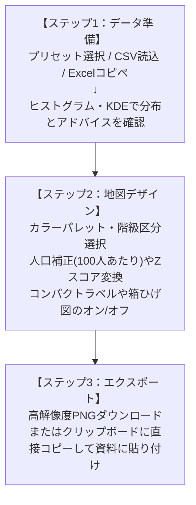

# 青森県市町村コロプレスツール 利用者マニュアル＆リファレンス

本ツールは、青森県内全40市町村の各種統計データ（人口、面積、産業、労働、医療、福祉、財政など）から、美しく見やすい色分け地図（コロプレスマップ）を直感的に作成・分析・エクスポートできるWebアプリケーションです。

データは外部サーバーへ一切送信されず、すべてお使いのWebブラウザ内（ローカル環境）で安全かつ高速に処理されます。

---

## 📌 目次
1. [本ツールの特長](#1-本ツールの特長)
2. [動作環境・起動方法](#2-動作環境起動方法)
3. [クイックスタート（基本操作フロー）](#3-クイックスタート基本操作フロー)
4. [データ読み込み ＆ 統計分析（ステップ1）](#4-データ読み込み--統計分析ステップ1)
   - [データ取り込み（3通りの方法）](#4-1-データ取り込み3通りの方法)
   - [「単位」と「出典」行の自動認識・反映](#4-2-単位と出典行の自動認識反映)
   - [公的統計基準に準拠した「0」と「欠測・秘匿（X / - / …）」の厳密な区別](#4-3-公的統計基準に準拠した0と欠測秘匿x-----の厳密な区別)
   - [統計分布（ヒストグラム ＆ KDE密度曲線）と自動判定アドバイス](#4-4-統計分布ヒストグラム--kde密度曲線と自動判定アドバイス)
   - [多変量データの一括選択・市町村名自動ゆらぎ補正](#4-5-多変量データの一括選択市町村名自動ゆらぎ補正)
5. [マップデザイン ＆ レイアウト設定（ステップ2）](#5-マップデザイン--レイアウト設定ステップ2)
   - [数値変換・分析モード（実測値 / 人口補正 / Zスコア / 偏差値）](#5-1-数値変換分析モード実測値--人口補正--zスコア--偏差値)
   - [カラーパレット ＆ 白黒印刷向けパターン（ハッチング）](#5-2-カラーパレット--白黒印刷向けパターンハッチング)
   - [階級区分法（Jenks自然分類・等間隔・分位数）](#5-3-階級区分法jenks自然分類等間隔分位数)
   - [地図上の市町村ラベル（コンパクト表示 ＆ 有界フォースレイアウト）](#5-4-地図上の市町村ラベルコンパクト表示--有界フォースレイアウト)
   - [マップ内「箱ひげ図（ボックスプロット）」による分散可視化](#5-5-マップ内箱ひげ図ボックスプロットによる分散可視化)
   - [凡例（レジェンド）の自動構成](#5-6-凡例レジェンドの自動構成)
6. [結果のエクスポート ＆ データ出力](#6-結果のエクスポート--データ出力)
7. [よくある質問（FAQ）](#7-よくある質問faq)
8. [ディレクトリ構成と使用ライブラリ](#8-ディレクトリ構成と使用ライブラリ)

---

## 1. 本ツールの特長

* 🔒 **安心の完全ローカル処理**: データを外部サーバーに送信しないセキュア設計。独自調査データや機密内部資料も安全に扱えます。
* 📊 **豊富なプリセットデータ（100指標以上収録）**: 「令和8年 青森県統計年鑑 市町村データ100」および「統計でみる市区町村のすがた 2026」を標準収録。ワンクリックで即座に作図・比較できます。
* 📋 **Excel / Web表のコピペ・CSV一括読み込み**: 表データをコピー＆ペーストするだけで自動認識。市町村名の省略（「弘前」→「弘前市」等）や「単位」「出典」行も全自動でパースされます。
* 🛡️ **統計的完全性（0と欠測・秘匿の厳密な区別）**: 公的統計の基準に準拠し、「0（実績値ゼロ）」と「X（秘匿）」「-（欠測・該当なし）」を明確に分離。誤認（ミスリード）のない中立色・破線枠・独立凡例で表現します。
* 📈 **ヒストグラム ＆ マップ内箱ひげ図**: データの偏り（歪度）をヒストグラムで把握し、地図上には集団の分散を示すボックスプロットを同時描画。地図と統計値がシームレスに連動します。
* 🏷️ **領域内に綺麗に収まるスマートラベル**: 田舎館村や藤崎町など狭小自治体のラベルが海や県外に飛び出さない「有界フォースレイアウト（変位制限）」と、すっきり収容できる「コンパクト表示」を搭載。
* 🎨 **多彩な配色 ＆ 白黒印刷対応**: カラーグラデーション、Zスコア専用の発散型パレットに加え、白黒論文や公的報告書向けのSVGハッチング（斜線・点模様）も完備。
* 🖼️ **高解像度PNG保存 ＆ クリップボード直貼り**: プレゼン資料や報告書へワンクリックで高精細PNG書き出し、または直接貼り付け（Ctrl+V）コピーが可能です。

---

## 2. 動作環境・起動方法

特別なソフトウェアのインストールは不要です。モダンブラウザとPython等の簡易Webサーバー環境があれば動作します。

1. **推奨ブラウザ**: Google Chrome, Microsoft Edge, Mozilla Firefox, Safari
2. **起動手順**:
   - ターミナルでアプリフォルダに移動し、サーバーを起動します：
     ```bash
     ./start_server.sh
     # または
     python3 -m http.server 3000
     ```
   - ブラウザで `http://localhost:3000` にアクセスするとアプリが立ち上がります。

---

## 3. クイックスタート（基本操作フロー）



---

## 4. データ読み込み ＆ 統計分析（ステップ1）

### 4-1. データ取り込み（3通りの方法）

操作パネル上部の「① データの読み込み・選択」から、以下の3通りの方法でデータを読み込めます：

1. ✨ **プリセットデータから選ぶ**:
   - **R8青森県統計年鑑 市町村データ100**（面積、人口、産業、製造品出荷額、医療、財政など100指標）
   - **統計でみる市区町村のすがた 2026**（e-Stat主要社会経済指標）
2. 📁 **CSV / Excelファイルから読み込む**:
   - `.csv`, `.tsv`, `.xlsx` ファイルをドラッグ＆ドロップするか、「ファイルを選択」から指定します。
3. 📋 **テキスト一括貼り付け（コピー＆ペースト）**:
   - Excelのセル範囲やWebブラウザ上の表を範囲選択してコピー（Ctrl+C）し、入力枠へ貼り付け（Ctrl+V）後、「データを解析して反映」を押します。

### 4-2. 「単位」と「出典」行の自動認識・反映

CSVやExcelの市町村列の中に「単位」「出典」という行が存在する場合、本ツールはそれを**自治体データではなくメタデータ行として自動判別**します：
- **「単位」行**: 各列に記載された単位（例: `人`, `百万円`, `k㎡`, `%`）を読み取り、画面の「数値の単位」欄および凡例に自動セットします。
- **「出典」行**: 記載された出典情報（例: `令和8年 青森県統計年鑑 市町村データ100（県統計分析課）`）を読み取り、地図下部の備考欄に自動入力します。

### 4-3. 公的統計基準に準拠した「0」と「欠測・秘匿（X / - / …）」の厳密な区別

公的統計（総務省統計局など）において、「0（実績値がゼロ）」と「X（秘匿）」「-（皆無・該当なし）」は全く異なる意味を持ちます。本ツールでは読者の誤解を防ぐため、以下のように厳密に区別して処理します：

| 記号・値 | 統計上の意味 | 本ツールでの地図表現 | 凡例・詳細カードでの扱い |
| :--- | :--- | :--- | :--- |
| **0** | **実績値がゼロ**<br>（例: 死亡者数0人、該当施設0件） | 通常の第1階級（最も薄い青など）の実測値として塗り分け | 通常の数値階級として表示 |
| **X** | **秘匿（秘密保護）**<br>（企業数が少なく特定されるため非公開） | **中立スレートグレー**（`#cbd5e1`）＋**破線（点線）枠** | 凡例に「■ 秘匿 (X)」を独立表示。<br>クリック時に「※秘密保持のため非公開（集計対象外）」と明記 |
| **-** / **…** | **欠測・該当なし・不詳**<br>（対象が存在しない、計算不能） | **薄い中立グレー**（`#e2e8f0`）＋**破線（点線）枠** | 凡例に「■ 欠測・該当なし」を独立表示。<br>クリック時に「※統計集計対象外」と明記 |

> [!IMPORTANT]
> **統計分析への影響防止**:
> 秘匿（X）や欠測（-）は、平均値・中央値・四分位数・標準偏差・箱ひげ図・Jenks分類の**計算母数から厳密に除外**されます。これにより、「秘匿を0として計算して平均値が不当に下がる」といった分析の誤りを完全に防止します。

### 4-4. 統計分布（ヒストグラム ＆ KDE密度曲線）と自動判定アドバイス

データを読み込むと、選ばれた指標の度数分布ヒストグラムとカーネル密度推定（KDE）曲線が描画されます。
- **統計サマリー**: 有効データ数、最小値、最大値、平均値、中央値、歪度（Skewness）をリアルタイム計算。
- **自動判定アドバイス**:
  - **① 数値変換アドバイス**: データの偏りや指標の性質（実数・総数か、割合・率か）を自動診断し、「100人あたり(%)への人口補正」や「Zスコア/偏差値変換」が推奨される場合は理由付きで提案します。
  - **② 階級区分法アドバイス**: 分布の左右非対称性や飛び離れた値の有無に基づき、「Jenks自然分類法」または「等間隔分類」のどちらが適切かを推薦します。

### 4-5. 多変量データの一括選択・市町村名自動ゆらぎ補正

- **変数の切り替え**: 複数列を含むデータを読み込んだ場合、ヘッダー部やサイドバーのドロップダウン、または「変数を選択」モーダルからワンクリックで切り替えられます。
- **強力な市町村名正規化エンジン**:
  - 市町村名の「市・町・村」の省略（例: 「黒石」→「黒石市」、「板柳」→「板柳町」）
  - ひらがな・カタカナ表記（例: 「おいらせ」→「おいらせ町」、「ひろさき」→「弘前市」）
  - ヶ/ケ/ガの表記ゆれ（例: 「鰺ケ沢町」→「鰺ヶ沢町」、「三戸」→「三戸町」）
  を自動判定・補正し、マッチング結果レポートを表示します。

---

## 5. マップデザイン ＆ レイアウト設定（ステップ2）

### 5-1. 数値変換・分析モード（実測値 / 人口補正 / Zスコア / 偏差値）

目的に応じて以下の統計変換を瞬時に適用できます：
- **実測値（そのままの数値）**: 入力された原数値をそのまま色分けします。
- **人口100人あたり（％）**: 自治体の基準人口（推計人口）で割り、人口100人あたりの数値に換算（人口規模の格差を相殺）。
- **人口1,000人あたり / 1人あたり**: それぞれ1,000人・1人あたりの値に換算。
- **Zスコア（標準化偏差 : 平均=0, SD=1）**: 全体平均を0、標準偏差を1とした相対的な乖離度合いに変換。
- **偏差値（Tスコア : 平均=50, SD=10）**: 受験や能力指標でおなじみの平均50、標準偏差10の尺度に変換。

### 5-2. カラーパレット ＆ 白黒印刷向けパターン（ハッチング）

- **標準カラーパレット**: ブルー（単色系）、グリーン、オレンジ、レッド、パープル、Viridis、Cividis、Magma、Spectralなど。
- **白黒印刷・学術論文向けパターン（SVGハッチング）**:
  - モノクロ印刷や白黒コピーでも階級の差が明確に判別できるよう、斜線・格子・ドット・クロスハッチなどのSVG模様で塗り分けるモードを搭載。
- **発散型パレット（Diverging）**:
  - Zスコアや偏差値選択時に推奨されるパレット（青-赤、赤-青、茶-青緑など）。平均値（0または50）を中間色の白・淡色とし、高低両極を鮮やかに際立たせます。

### 5-3. 階級区分法（Jenks自然分類・等間隔・分位数）

- **Jenks（自然段階分類法）[推奨]**: データの自然なクラスタ（谷間）を検出し、グループ内のばらつきを最小化・グループ間の差異を最大化する境界を自動計算します。
- **等間隔分類（Equal Interval）**: 最小値から最大値までを均等な数値幅で分割します。
- **分位数分類（Quantile）**: 各階級に含まれる自治体数が均等（40自治体の5階級なら各8自治体）になるように分割します。
- **カスタム境界**: ユーザーが任意の境界数値を指定して自由に区分することも可能です。

### 5-4. 地図上の市町村ラベル（コンパクト表示 ＆ 有界フォースレイアウト）

地図上の市町村名・数値ラベルは、用途に合わせて以下の4つのスタイルから選べます：

1. **表示しない（クリーンな地図）**: 地図の純粋なグラデーションのみを見せたい場合に最適。
2. **主要10市のみ表示（すっきり・重なりなし）**: 県内の主要10市のみをピックアップ表示。
3. **全40自治体 コンパクト表示（推奨：領域内にスマート収容）**:
   - 市町村名と数値を1行のインライン形式（例: `田舎館 7.3千`）にスリム化。
   - 田舎館村や藤崎町などの狭小自治体でも、引き出し線を出さずに自治体領域内に綺麗に収まります。
4. **全40自治体 標準表示（領域制限・重なり自動調整）**:
   - 市町村名と数値を2段組で表示。大きく位置調整された場合のみ細い点線の引き出し線を表示します。

> [!TIP]
> **有界フォースレイアウト（Bounded Force-Directed Layout）**:
> 本ツールの自動重なり回避アルゴリズムには「重心からの最大移動距離制限（クランプ）」と「焼きなまし減衰」が組み込まれており、ラベルが海（日本海・陸奥湾）や県外へ吹き飛んでしまう現象を物理的に防止しています。

### 5-5. マップ内「箱ひげ図（ボックスプロット）」による分散可視化

地図上の凡例と反対側の位置（空きスペース）に、データのばらつき度合いを示す**ミニ箱ひげ図**を自動描画できます：
- **構成要素**:
  - 外れ値を含む最小値（Min）、第1四分位数（Q1）、中央値（Median）、第3四分位数（Q3）、最大値（Max）。
  - 右側に現在のカラーパレットの階級区分カラーバーを配置し、箱ひげ図の各位置がどの階級色に対応しているかを視覚的にリンク。
- **マップ連動ハイライト**:
  - 地図上の自治体にマウスを乗せると、箱ひげ図上に対応する数値の位置を示す点線と数値バッジがリアルタイムに出現します。
- **オン/オフ・配置設定**:
  - チェックボックスで表示/非表示を切り替え可能。配置は凡例の位置に応じて「自動（凡例の反対側の中段）」に最適配置されます。

### 5-6. 凡例（レジェンド）の自動構成

- **数値階級バー**: 各階級の数値範囲（例: `1.2万 ～ 3.5万`）と該当する自治体数カウントバッジを表示。
- **特殊値（秘匿・欠測）の独立表示**:
  - 秘匿（X）や欠測（-）が存在する場合、階級バーの下部に破線区切りで「■ 秘匿 (X)」「■ 欠測・該当なし」が自動的に追加されます。
- **配置位置の変更**: 右中、右上、右下、左中、左上、左下から自由に配置を変更できます。

---

## 6. 結果のエクスポート ＆ データ出力

1. **📥 マップ画像保存 (PNG)**:
   - 地図、タイトル、凡例、箱ひげ図、注釈、出典を高解像度PNG画像（標準の3倍スケール、印刷にも耐えるクオリティ）として書き出します。
2. **📋 クリップボードへ画像コピー**:
   - ワンクリックで画像をクリップボードに格納。PowerPointやWord、Teams、Slackへ直接 `Ctrl+V`（貼り付け）できます。
3. **📁 現在のデータをCSVで書き出し**:
   - 画面で編集したデータや変換後の数値を、市町村コード・名称付きのCSVファイルとしてダウンロードできます（秘匿記号なども保持されます）。

---

## 7. よくある質問（FAQ）

### Q1. 「0」と「-」や「X」の違いは何ですか？同じ色で塗ってはダメですか？
**A.** 絶対に同じ色で塗ってはいけません。「0」は調査の結果ゼロであったという確定値ですが、「X（秘匿）」は特定企業の秘密保持のために数値を伏せているだけであり、実際には大きな産業規模が存在する可能性があります。「0」と同じ色で塗ると読者に誤解（「この地域には産業が全くない」等）を与えるため、本ツールでは中立グレー＋破線枠＋独立凡例で厳密に区別しています。

### Q2. 田舎館村や藤崎町などのラベルが重なったり海にはみ出したりしませんか？
**A.** はみ出さない設計になっています。全40自治体を表示する場合は「**コンパクト表示**」を選択してください。1行インライン表示と有界フォースレイアウトにより、狭小な自治体でも領域内に整然と収まります。

### Q3. 「人口1人あたり市町村民所得」を読み込んだとき、二重に人口補正を促されませんか？
**A.** いいえ。本ツールは指標名や単位に「1人あたり」「割合」「%」などが含まれている場合、すでに単位補正済みであると賢く判断し、二重の人口変換を促すことはありません。

### Q4. 箱ひげ図を消したいのですが、どうすればよいですか？
**A.** 左側設定パネルの「凡例・ボックスプロット配置」セクションにある「箱ひげ図（ボックスプロット）を表示する」のチェックを外すだけで、いつでも非表示にできます。

---

## 8. ディレクトリ構成と使用ライブラリ

### ディレクトリ構成
```text
aomori_choropleth_app/
├── index.html        # メインUI（Bootstrap風グリッド、レスポンシブコンテナ）
├── style.css         # スタイリング（コンテナクエリ、ダークテーマ、SVG凡例）
├── app.js            # コアロジック（パース、有界物理演算、箱ひげ図、正規化エンジン）
├── start_server.sh   # 起動用シェルスクリプト
├── start_server.py   # 起動用Pythonスクリプト
├── vendor/           # 完全オフライン用ライブラリ（Leaflet, FontAwesome）
├── data/             # 地図GeoJSON境界データ & プリセット統計CSV
│   ├── aomori_municipalities.geojson   # 青森県40市町村ポリゴン
│   ├── nenkan_data100.csv              # 令和8年青森県統計年鑑 市町村データ100
│   └── sugata2026.csv                  # 統計でみる市区町村のすがた 2026
└── README.md         # 利用者マニュアル＆リファレンス（本ドキュメント）
```

### 使用ライブラリ（完全オフライン・フロントエンド）
* **[Leaflet.js](https://leafletjs.com/)**: 軽量・高性能な地図描画ライブラリ
* **[FontAwesome](https://fontawesome.com/)**: UIおよび地図シンボルアイコン
* すべての処理はブラウザのJavaScriptエンジン内で完結しており、外部ネットワークへの通信は一切行いません。

---

*【青森県市町村コロプレスツール】*
*青森県40市町村の統計データを美しく可視化し、地域分析・行政施策・オープンデータ活用を支援します。*
